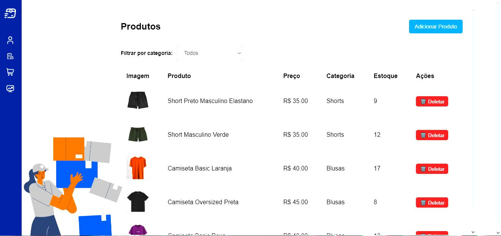

<h1 align="center">Jodyson João</h1>

  <em>Desenvolvedor .NET e React.</em>

---

##  Sobre mim
-  Estudante e programador focado em backend com .NET e frontend com React.
-  Atualmente procurando meu lugar no mercado de trabalho.
-  Prazer por aprender, construir e resolver problemas com código.

---

##  Tecnologias que uso

---

##  Projeto em destaque

###  Sistema de Estoque

  

> Dashboard com visualização de produtos, pedidos, autenticação com JWT e organização por categorias.

🔗 [Veja o repositório](https://github.com/JodysonJoao/Estoque-Fullstack)

---

## 📫 Como me encontrar

---

  💻 "Codando com propósito, aprendendo com intensidade."

****
